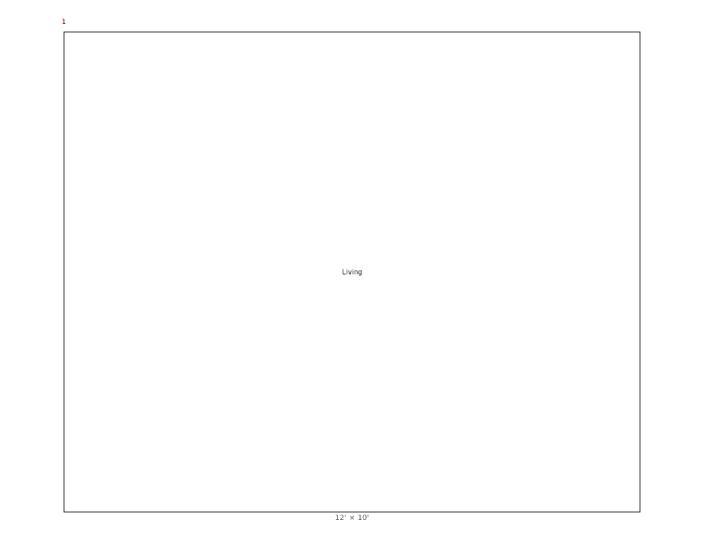
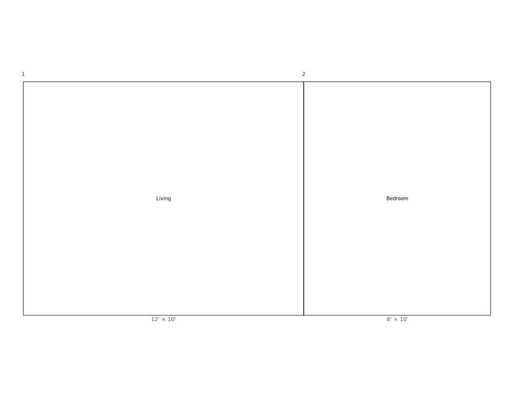
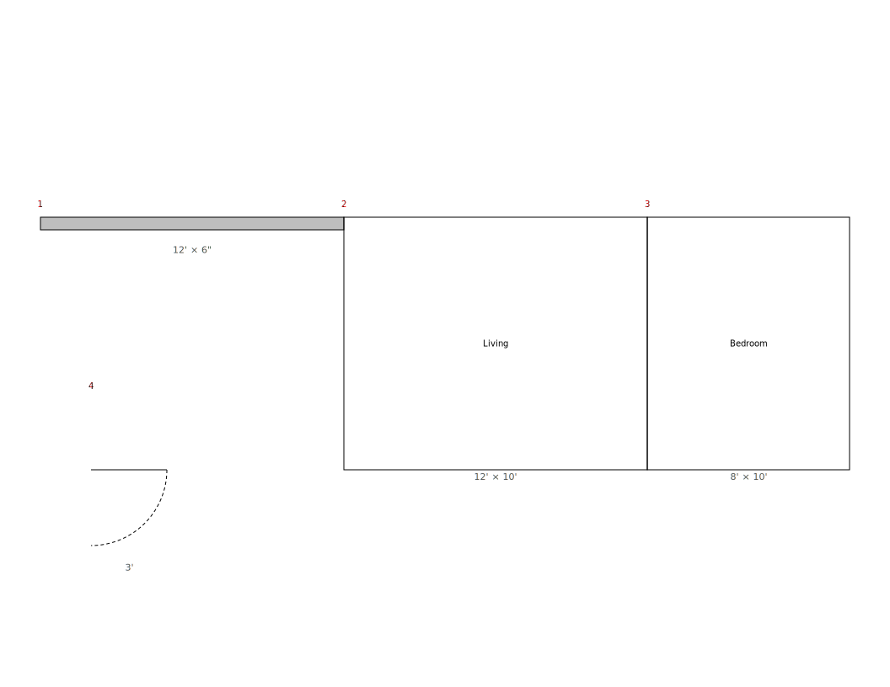
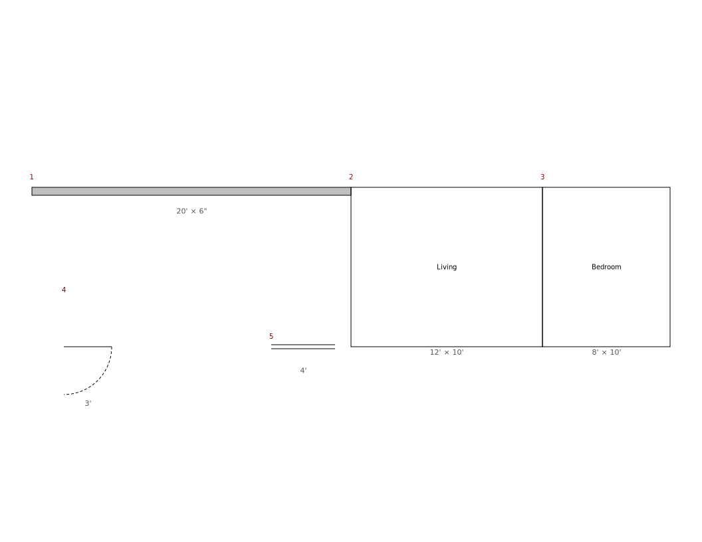
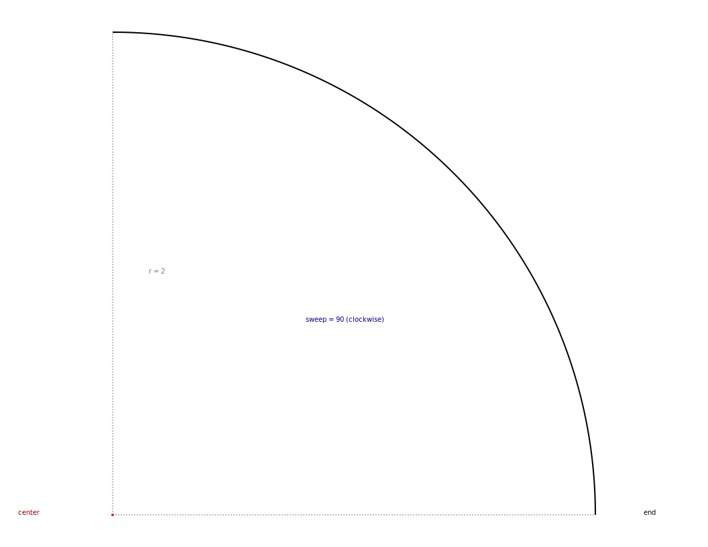
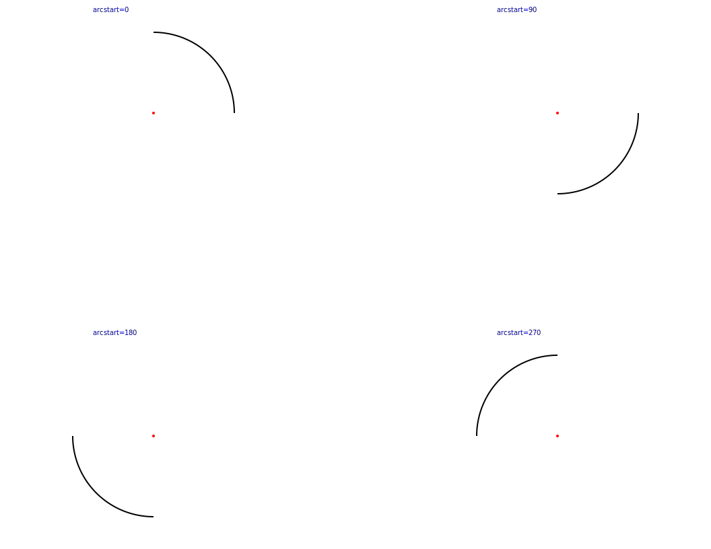
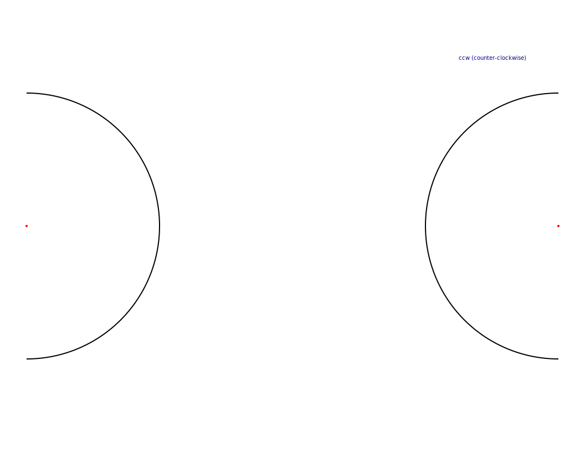

<!-- $Source: /srv/380-svg/30-source/docs/RCS/380-080-SVGDSL-users-guide.md,v $ -->
# SVG DSL User Guide

A reference manual for the SVG DSL, a small text-based language for producing
Scalable Vector Graphics (SVG) drawings. You write drawing commands in a `.dsl`
file, run the `svgdsl` renderer, and view the result in any browser.

---

## Table of contents

**Part I — Getting started**

<div style="column-count:2;-moz-column-count:2;-webkit-column-count:2">

1. Introduction
1.1 What SVG DSL is
1.2 Workflow
1.3 Conventions used in this guide
2. Overview
2.1 Tutorial: quick start
2.2 Running the program
2.3 CLI options
2.4 The browser viewer
2.5 Output files

</div>

**Part II — Language overview**

<div style="column-count:2;-moz-column-count:2;-webkit-column-count:2">

3. Language overview
3.1 Drawing statements
3.2 Text statements
3.3 Directives
3.4 Numeric variables and math
3.5 String variables and string functions
3.6 Tuples
3.7 Control flow
3.8 Named functions
3.9 Debugging statements

</div>

**Part III — Language reference**

<div style="column-count:2;-moz-column-count:2;-webkit-column-count:2">

4. Language reference
4.1 Statement structure
4.2 Comments and statement separators
4.3 Measurements
4.4 Numbers
4.5 Strings
4.6 Tuples
4.7 Variable assignment and auto-typing
4.8 Variable substitution and inline expressions
4.9 System variables
4.10 Built-in functions
4.11 Coordinates and absolute placement
4.12 Per-element color override (C=)
4.13 Element naming (@name)
4.14 Line weight and dash patterns
4.15 Drawing cursor and direction
4.16 Control-flow syntax
4.17 Function definition syntax
4.18 Multiple statements per line
4.19 Tutorial: building up a drawing

</div>

**Part IV — Alphabetical reference**

<div style="column-count:2;-moz-column-count:2;-webkit-column-count:2">

5. Alphabetical reference: statements & directives
5.1 arc
5.2 arrow
5.3 circle
5.4 color
5.5 def
5.6 dimensions
5.7 direction
5.8 door
5.9 elementid
5.10 for
5.11 if / elif / else
5.12 include
5.13 label
5.14 line
5.15 lineto
5.16 moveto
5.17 point
5.18 rect
5.19 return
5.20 showcornerxy
5.21 textappend
5.22 textbox
5.23 textbreak
5.24 textline
5.25 textstyle
5.26 wall
5.27 window
5.28 Tutorial: parametric reuse

</div>

**Part V — Debugging**

<div style="column-count:2;-moz-column-count:2;-webkit-column-count:2">

6. Debugging overview
6.1 Visual debugging directives
6.2 Execution control
6.3 Variable inspection
6.4 Trace mode
6.5 Where to find full detail

</div>

---

## 1. Introduction

### 1.1 What SVG DSL is

SVG DSL is a small domain-specific language for producing **Scalable Vector
Graphics (SVG)** images from a text description. The pipeline is:

```
your-file.dsl  ──►  svgdsl  ──►  output.svg  ──►  any browser
```

You write drawing commands — lines, rectangles, walls, doors, arcs, labels,
text — in a plain-text `.dsl` file. The `svgdsl` renderer converts the file
into a self-contained SVG document. The SVG opens directly in any web browser;
no plug-ins, no build pipeline.

The language is small, declarative, and side-effect oriented. There is a
drawing **cursor** that advances after most statements, a current drawing
**direction**, and a small set of toggleable display states (element IDs,
dimension labels, corner-coordinate markers). On top of that sit numeric,
string, and tuple variables, `if`/`for` control flow, and user-defined
functions for reuse.

### 1.2 Workflow

The intended development loop is:

1. **Start the browser viewer** (see §[2.4](#24-the-browser-viewer)). It auto-refreshes every two seconds.
2. **Edit** the `.dsl` source file in your editor of choice.
3. **Run the renderer** (see §[2.2](#22-running-the-program)) to overwrite `output.svg`.
4. **View** — the viewer picks up the new file automatically.
5. **Iterate** — repeat until the drawing looks right.

This loop is deliberately short. Most users alt-tab between editor and browser
and re-run the renderer after each significant change.

### 1.3 Conventions used in this guide

| Notation in this guide | Meaning |
|---|---|
| `keyword` | A literal keyword in DSL source |
| ***param*** | A required parameter — replace with your own value |
| [`optional`] | An optional parameter (brackets are not typed) |
| `alt1 \| alt2` | Choose one of the alternatives |
| §N.N | Cross-reference to a section of this guide |
| Aliases | Most statements and directives have short aliases (e.g. `r` for `rect`). Full names are documented first; aliases follow. |

Placeholders are written in ***bold italic*** so they render reliably in any
markdown viewer. Some renderers eat literal angle-bracket placeholders such
as the older "angle-name-angle" form because the brackets look like HTML
tags, so the guide avoids that style for placeholder names.

Example snippets are valid DSL unless explicitly marked otherwise. Snippets
that demonstrate an error are flagged with a comment such as `# ERROR`.

---

## 2. Overview

### 2.1 Tutorial: quick start

Create a file `hello.dsl` containing:

```
rect 6 4 "hello"
direction 180
line 6
direction 270
line 4
```

Render it:

```
bin/380-010.sh hello.dsl
```

(or `python -m svgdsl.cli hello.dsl` if you prefer the Python entry point).
You should see:

```
Wrote output.svg
```

Open `assets/380-030.html` in a browser. The viewer reloads every two seconds
and will display your drawing — a labelled 6×4-foot rectangle with two short
lines that close it on the bottom and left.

That's the entire loop. The rest of this guide expands on what each part of
that snippet means and what else you can do.

### 2.2 Running the program

The renderer is invoked in three equivalent ways:

#### 2.2.1 Shell driver (recommended)

```
bin/380-010.sh <input.dsl> [output.svg] [--paper letter|tabloid]
```

This is a thin wrapper around the Python entry point. The first positional
argument is your DSL source; the second (optional) is the SVG output path.

#### 2.2.2 Python module

```
python -m svgdsl.cli <input.dsl> [-o output.svg] [-p letter|tabloid]
```

Or with `uv`:

```
uv run python -m svgdsl.cli <input.dsl> [-o output.svg] [-p letter|tabloid]
```

#### 2.2.3 Stdin

Omit the input file argument and the renderer reads DSL from standard input:

```
cat myfile.dsl | python -m svgdsl.cli -o out.svg
echo 'rect 4 3 "test"' | python -m svgdsl.cli
```

Include directives in stdin mode resolve relative to the current working
directory.

### 2.3 CLI options

| Flag | Default | Meaning |
|---|---|---|
| `-o`, `--output` | `output.svg` | Path to the SVG file the renderer writes. |
| `-p`, `--paper`  | `letter` | Paper size: `letter` (11×8.5 in, 1056×816 px) or `tabloid` (17×11 in, 1632×1056 px). Always landscape. |

The drawing is auto-scaled to fit the chosen page with 0.5-inch margins on all
sides (see §[2.5](#25-output-files)).

### 2.4 The browser viewer

`assets/380-030.html` is a minimal SVG viewer that:

- displays `../output.svg` by default,
- reloads it automatically every **2 seconds**,
- has a path field in the toolbar — type a different relative or absolute path
  to view a different SVG file.

The viewer is plain HTML/JS, with no dependencies. Open it once and leave it
in a side window; each new render appears within a second or two of being
written.

If your browser is on Windows and the file lives in WSL, open the viewer
through the Windows browser (e.g.
`file://wsl.localhost/Ubuntu/srv/380-svg/30-source/assets/380-030.html`).
Linux browsers running inside WSL can also display it but use the X server
chain, which is often slower.

### 2.5 Output files

The renderer writes a single self-contained SVG file. Its top-level structure
is:

```xml
<svg width="11in" height="8.5in" viewBox="0 0 1056 816">
  <defs> ... arrowhead and pattern markers ... </defs>
  <g id="drawing" transform="translate(tx,ty) scale(k)">
    ... all geometry, in feet, scaled and centred ...
  </g>
</svg>
```

Notable properties:

- **Internal units are feet.** Every length, position, and dimension you write
  in DSL is interpreted in feet (with optional inch/px suffixes — see
  §[4.3](#43-measurements)). The renderer applies a single `scale()` transform at
  the end, so the SVG itself is unitless inside the `<g>`.
- **Auto-scale.** The renderer computes a uniform scale factor so the
  drawing's bounding box fits within an 8×10-inch (or 16×10-inch for tabloid)
  print rectangle. The drawing is centred on the page.
- **Canvas origin.** The point `(0, 0)` in DSL coordinates is the top-left
  corner of the bounding box of the first element. All `A=` coordinates and
  `$__cursorx`/`$__cursory` are relative to this origin.
- **Annotations.** Element ID numbers (red) and dimension labels (grey) are
  emitted alongside each element when their respective directives are on.
  Both default to **off** — turn them on with `elementid on` / `dimensions on`
  (or the aliases `eid on` / `dim on`) at the top of the file while you are
  developing a drawing. See §[5.6](#56-dimensions) and
  §[5.9](#59-elementid).

---

## 3. Language overview

This section is a survey: each subsection introduces a category of statements
and points to the alphabetical reference
(§[5](#5-alphabetical-reference-statements--directives)) for full detail.

### 3.1 Drawing statements

These statements emit visible geometry on the canvas. Most advance the cursor
along the current drawing direction by their length.

| Statement | Alias | Purpose |
|---|---|---|
| `line` | `l` | Straight line in the current direction. |
| `rect` | `r` | Open rectangle, `length × width`. |
| `wall` | `w` | Filled rectangle for structural walls. |
| `door` | `d` | Door slab plus swing arc. |
| `window` | `wi` | Pair of parallel lines across an opening. |
| `arc` | `a` | Arc on a circle of given radius and sweep. |
| `arrow` | `aw` | Line with an arrowhead at the end. |
| `circle` | `ci` | Open circle. Does **not** advance the cursor. |
| `point` | `p` | Small dot. Does **not** advance the cursor. |
| `label` | `lb` | Text annotation. Does **not** advance the cursor. |
| `moveto` | `mto` | Jump the cursor without drawing. |
| `lineto` | `lto` | Draw a line from the cursor to an absolute destination. |

Full reference: §[5](#5-alphabetical-reference-statements--directives).

### 3.2 Text statements

Text statements layer formatted text on or around named geometry.

| Statement | Alias | Purpose |
|---|---|---|
| `textline` | `txl` | Text alongside a named element, rotated to match. |
| `textbreak` | `txbr` | Text with a white-mask box that visually breaks a line. |
| `textbox` | `tbox` | Stroked rectangle with text inside; advances cursor like `rect`. |
| `textappend` | `tapp` | Append a text row to a named rect or textbox. |

See §[4.5](#45-strings) for inline markup (`*italic*`, `**bold**`, `\n`).
Full reference starts at §[5.21](#521-textappend).

### 3.3 Directives

Directives change interpreter or renderer state. They do not themselves emit
geometry.

| Directive | Alias | Effect |
|---|---|---|
| `direction` | `dir` | Set the drawing direction in degrees (0 = up, 90 = right, …). |
| `color` | `col` | Set the stroke color for subsequent elements. |
| `elementid` | `eid` | Show / hide element ID numbers. |
| `dimensions` | `dim` | Show / hide dimension labels. |
| `showcornerxy` | `sxy` | Show / hide cursor-position markers at direction changes. |
| `include` | `inc` | Insert the contents of another DSL file. |
| `textstyle` | `tstyle` | Set default font size and family for text elements. |

Full reference: §[5](#5-alphabetical-reference-statements--directives).

### 3.4 Numeric variables and math

Numeric variables hold floating-point values. Assign with `=`, reference with
`$name` or `${name}`, and use `(expr)` for inline arithmetic.

```
roomw = 14
roomh = 11
half  = $roomw * 0.5
rect (roomw - 2) $roomh "Living"
```

The supported operators are `+ - * /` with standard precedence. Compound
assignment uses `+=` and `-=`. Full grammar: §[4.8](#48-variable-substitution-and-inline-expressions).

### 3.5 String variables and string functions

Strings hold arbitrary text. They are declared with `string` or auto-typed
from a quoted RHS:

```
string title = "Living Room"
greeting = "Hello, world"
```

Concatenation uses `+` or `+=`. Built-in functions `len`, `substr`, `match`,
`replace` operate on strings, with regex semantics for `match` and `replace`.
Full reference: §[4.10](#410-built-in-functions).

### 3.6 Tuples

A tuple is an ordered sequence of numeric and/or string members. Tuples are
written `(a, b)`, indexed `t[i]`, and support element-wise math:

```
tuple p = (3, 4)
tuple q = p + (1, 1)            # (4, 5)
numeric x = p[0]
```

Tuples interoperate with coordinate-bearing statements: any 2-tuple can be
passed where a coordinate is expected. Full reference: §[4.6](#46-tuples).

### 3.7 Control flow

`if`/`elif`/`else` and `for ... to ... step` are supported, with brace-delimited
bodies:

```
if (n == 3) {
    color red
} elif (n == 2) {
    color blue
} else {
    color green
}

for i = 0 to 5 {
    line 1
}
```

Bare blocks (`{ ... }` with no header) group statements visually. They do
**not** introduce a new variable scope. Full reference: §[4.16](#416-control-flow-syntax).

### 3.8 Named functions

User-defined functions encapsulate reusable drawing logic. Define with `def`,
return with `return`:

```
def room(w, h, name) {
    rect w h $name
}

room(12, 10, "Living")
room(8, 8, "Bedroom")
```

Parameters and `=`-assignments inside the body are **local** — they do not
overwrite globals of the same name. Drawing statements have their normal
side effects (they update the cursor and place geometry).

Full reference: §[4.17](#417-function-definition-syntax) and §[5.5](#55-def).

### 3.9 Debugging statements

These directives are aids for development and don't affect the final SVG by
themselves:

| Directive | Purpose |
|---|---|
| `stop` / `breakpoint` / `bp` | Pause execution; open the interactive REPL on a terminal. |
| `start` | Resume execution after a `stop`. |
| `trace on \| off` | Echo each DSL line to stderr as it executes. Alias `tr`. |
| `vardump [path]` | Print a table of all variable values to stderr or a file. Alias `vd`. |
| `vartrace [(...)] [path]` | Record variable writes; print summary at end. |

Full reference: §[6](#6-debugging-overview). The interactive REPL, step modes,
and command set are documented in `docs/debugging-guide.md`.

---

## 4. Language reference

This section defines the **generic** structure of the DSL: tokens, expressions,
variables, and control flow. The per-statement reference is in
§[5](#5-alphabetical-reference-statements--directives).

### 4.1 Statement structure

Every DSL statement has the form:

> ***keyword*** [***required parameters***] [***optional parameters***]

- ***keyword*** is a directive name, statement name, or an alias
  (case-insensitive).
- Required parameters come in a fixed order documented per-statement in
  §[5](#5-alphabetical-reference-statements--directives).
- Optional parameters can appear in any order after the required ones.

The optional parameters fall into a small, shared vocabulary:

| Token | Meaning | Applies to |
|---|---|---|
| ***n***`px` | Line weight in SVG pixels | All geometry |
| `dashed`, `shortdash`, `dotted`, `center`, `hidden` | Dash pattern | All geometry |
| `C=`***color*** | Per-element stroke color override | All geometry |
| `A=`***h***`,`***v*** | Absolute placement, in feet from canvas origin | Most elements |
| `@`***name*** | Register element under a name for later text overlays | Most elements |
| `dim=on` / `dim=off` | Per-element dimension-label override | All annotated elements |
| `"text"` | Inline label (passed to renderers that accept one) | `rect`, `textbox`, `label`, text statements |
| `font=`***family*** | Font family override | Text elements, `label` |

Numeric parameters are written either as a literal measurement
(§[4.3](#43-measurements)), a variable reference
(§[4.8](#48-variable-substitution-and-inline-expressions)), or an inline
expression `(...)`.

### 4.2 Comments and statement separators

- A `#` outside a quoted string starts a line comment.
- A blank line is ignored.
- A `;` outside a quoted string separates statements on the same line.

```
# whole-line comment
rect 12 10 "Living Room"        # trailing comment
direction 90; line 10; direction 0; line 8
label "hello; world"            # ';' inside quotes is literal
```

### 4.3 Measurements

Lengths and coordinates are in **feet** unless a suffix is given. Inches,
mixed feet/inches, and SVG pixels are supported.

| Written | Meaning |
|---|---|
| `12` | 12 feet |
| `12.5` | 12.5 feet |
| `12'` | 12 feet (explicit suffix) |
| `6"` | 6 inches = 0.5 feet |
| `12'6"` | 12 feet 6 inches = 12.5 feet |
| `2px` | 2 SVG pixels — **line-weight only**, never lengths |
| `0px` | Invisible. No geometry is drawn and no annotations are emitted; the cursor still advances on length-bearing elements. |

Internal storage is always feet (float). The renderer applies one scale
transform at the end to map feet to SVG user units (96 dpi).

### 4.4 Numbers

Numeric literals are decimal floats: `12`, `12.5`, `-3`, `0.25`.

**Leading zero required for fractions less than one.** The tokenizer matches
numbers as `digits[.digits]`, so a bare `.5` is not a number — write `0.5`
instead. The same rule applies inside inline `(...)` expressions and inside
string-formatted dimension arguments.

```
line 0.5          # OK
line .5           # ERROR — tokenized as something other than a number
x = 0.25          # OK
y = (.25 * 2)     # ERROR — same reason
```

Scientific notation is supported in expression contexts (`1e3`, `2.5e-2`) but
should not appear in inline `(...)` expressions that are spliced into other
statements — the variable substitution layer would interpret the `e` as a
bare identifier. Use `($var)` to wrap any value that may need
re-substitution.

### 4.5 Strings

A string literal is delimited by double quotes (`"..."`) or single quotes
(`'...'`). Single quotes are only treated as string delimiters when they
cannot be a feet-or-inches measurement, so `wall 12'6"` is unaffected.

Inside any quoted string, the following inline markup is recognised by the
renderer:

| Markup | Renders as |
|---|---|
| `*text*` | *italic* |
| `**text**` | **bold** |
| `***text***` | ***bold italic*** |
| `\*` | literal asterisk |
| `\n` | line break |

Unclosed markup is treated as literal text. Inline markup works in `label`,
`rect`-with-label, `textline`, `textbreak`, `textbox`, and `textappend`.

### 4.6 Tuples

A tuple is an ordered sequence of numeric and/or string members, written
with parentheses or a bare-comma form:

```
tuple p = (3, 4)
tuple q = 1, 2, 3
tuple m = ("label", 5)
tuple empty
```

#### Indexing

`t[i]` reads member `i` (0-based). Works in `(expr)` arithmetic and on the RHS
of numeric or string assignments. `${name[i]}` interpolation is **not**
supported; copy the member to a scalar first.

```
numeric x = p[0]
numeric sum = (p[0] + p[1])
label "x=${x}"
```

#### Element assignment

`t[i] = expr` changes member `i`. The expression must match the member's
existing type (numeric or string).

```
p[0] = 10
p[1] = (p[0] * 2)               # p is now (10, 20)
```

#### Element-wise math

`+ - * /` on tuples operate member-by-member. The result length is
`min(len(a), len(b))`. A scalar on one side is applied to every member of the
tuple.

```
tuple a = (1, 2, 3)
tuple b = (10, 20)
tuple c = a + b                 # (11, 22) — result length 2
tuple d = a * 3                 # (3, 6, 9) — same multiplication applied to each member
```

#### Unpacking

```
tuple p = (3, 4)
x, y = p                         # x=3, y=4
(a, b) = (5, 6)                  # parentheses on LHS also accepted
```

The number of names on the LHS must equal `len(tuple)`.

#### Spread (tuple-from-tuple)

```
tuple p = (1, 2)
tuple q = (p, 3)                 # (1, 2, 3) — spread of p
```

#### As coordinate

Any place that accepts a 2-element coordinate accepts a 2-tuple in three
forms:

```
tuple origin = 1, 1
r 10 8 $origin
r 10 8 (2, 2)
r 10 8 2,2
```

#### Tuple system variables

`$__cursor` is a 2-element tuple updated after every placed element to reflect
the current cursor position. See §[4.9](#49-system-variables).

### 4.7 Variable assignment and auto-typing

A variable is assigned with `name = expr`. The type is **inferred** from the
right-hand side:

| RHS form | Inferred type | Example |
|---|---|---|
| Numeric literal or expression | numeric | `x = 12`, `y = (a + 1)` |
| Quoted string or string expression | string | `s = "hello"`, `s2 = s + " world"` |
| Tuple literal `(a, b)` or bare-comma `1, 2` | tuple | `p = (3, 4)`, `q = 1, 2, 3` |
| Existing variable (bare name) | same type as that variable | `t = s` (string), `n = x` (numeric) |

An explicit type declaration is also accepted, and gives a sensible default
when no initializer is provided:

```
numeric x = 5                    # explicit numeric
numeric y, z                     # default 0 each
string title = "Plan A"          # explicit string
string a, b, c                   # default "" each
tuple coords = (3, 4)            # explicit tuple
tuple empty                      # default ()
```

Once a variable has a type, assignments of a different type are rejected as a
parse error. The right-hand side may use any of `+ - * /`, `(expr)`, variable
references, and built-in calls — see §[4.8](#48-variable-substitution-and-inline-expressions) and §[4.10](#410-built-in-functions).

Compound assignment:

| Operator | Numeric | String | Tuple |
|---|---|---|---|
| `+=` | add | concatenate | element-wise add (with broadcast) |
| `-=` | subtract | — *(error)* | element-wise subtract |
| `*=` | — *(error on bare variables; see note)* | — | element-wise multiply |
| `/=` | — | — | element-wise divide |

`*=` and `/=` are only defined on tuple variables.

Names starting with `__` (double underscore) are **reserved** for system
variables and cannot be assigned to. Reserved keywords (`line`, `rect`, `if`,
`def`, etc.) also cannot be assigned to.

### 4.8 Variable substitution and inline expressions

The DSL has **two** mechanisms for getting a variable's value into a
statement:

#### Substitution: `$name` and `${name}`

`$name` (or `${name}` for embedded use) is a textual macro: the variable's
formatted value is spliced into the source before parsing. This is the form
used wherever a number, string, or tuple appears as a token in a statement.

```
rect $roomw $roomh
line ${lw}px dashed
label "${roomw}x${roomh} ft" center
mto $cursor                      # tuple variable
```

#### Inline expressions: `(expr)`

Wherever a number is allowed, `(expr)` is evaluated immediately. Bare
identifiers **inside** the parentheses are variable references — no `$` is
needed. `$name` and `${name}` *are* also accepted inside `(...)` (the
variable-substitution layer runs first, then the expression is evaluated), so
either form works:

```
n = 8
line (n/2)                       # length 4 — bare name
line ($n / 2)                    # length 4 — $-form also works
rect (roomw - 2) $roomh
door 3 A=2,(roomh - 0.5)
x = (a * (b + c))                # nested parens
```

Within numeric expressions the bare-name form is conventional and slightly
preferred — it makes the expression read like ordinary arithmetic.

Inline expressions support `+ - * /`, parentheses, comparisons `< > <= >= == !=`
when used inside `if (...)` conditions, and the four built-in functions
(§[4.10](#410-built-in-functions)). Tuple members `t[i]` are also recognised inside `(...)`.

Parentheses inside double-quoted label strings are **literal text** — they
are not evaluated.

#### Which form to use

| Context | Use | Example |
|---|---|---|
| Standalone numeric token | `$name` or `${name}` | `rect $w $h`, `line ${lw}px` |
| Embedded into a longer token | `${name}` | `${lw}px`, `"${w}x${h} ft"` |
| Inside `(expr)` arithmetic | bare name | `(n + 1)`, `(roomw * 0.5)` |
| As a function argument | bare name | `len(s)`, `replace(s, "x", "y")` |
| Inside an `if (...)` condition | bare name | `if (n == 3)`, `if (flag and not done)` |

`$s` on a string variable splices the *raw* characters of the string into the
source. That works when the splice forms a valid label, but it is **not** a
substitute for a value reference: `len($s)` becomes `len(hello)`, which is a
parse error. Use `len(s)` instead.

### 4.9 System variables

Names starting with `__` are managed by the interpreter and are **read-only**.
Attempting to write to one is a parse error.

| Variable | Alias | Type | Value |
|---|---|---|---|
| `$__cursorx` | `$__cx` | numeric | Cursor x in feet from canvas origin. |
| `$__cursory` | `$__cy` | numeric | Cursor y in feet from canvas origin. |
| `$__cursor` | — | tuple | 2-element `(cx, cy)`. Pass to coord-bearing statements as a whole; read members as `__cursor[0]` / `__cursor[1]` inside `(...)`. |
| `$__dir` | — | numeric | Current drawing direction in degrees (0 = up, 90 = right, …). |
| `$__mltodir` | — | numeric | Compass bearing of the most recent `moveto` or `lineto`, in degrees. |
| `$__dsl_filename` | — | string | Filename of the DSL file currently being processed (just the filename, not the full path). |
| `$__dsl_file_lineno` | — | numeric | Line number of the current statement. |
| `$__date` | — | string | Today's date in `YYYY-MM-DD` form, captured at interpreter start. |

Cursor, direction, and `__mltodir` update after every placed element or
directive. Filename and line number update before each statement runs.

```
direction 90
rect 12 10 "Living"
point C=red A=$__cx,$__cy        # mark the cursor with a red dot
label "dir=${__dir}" A=0,12
```

### 4.10 Built-in functions

Four built-in functions operate on strings (and `len` also on tuples). They
appear in expression contexts, not as statements. They are case-sensitive
and reserved.

| Function | Returns | Description |
|---|---|---|
| `len(s)` | numeric | Length of string `s`, or number of members in tuple `s`. |
| `substr(s, start)` | string | Characters from index `start` (inclusive) to end. 0-based; negative `start` counts from the end. |
| `substr(s, start, end)` | string | Characters from `start` (inclusive) to `end` (exclusive). |
| `match(s, pattern)` | numeric | `1` if regex `pattern` matches *anywhere* in `s`, else `0`. Implemented with Python `re.search`. |
| `replace(s, pattern, repl)` | string | Replace **all** non-overlapping regex `pattern` matches in `s` with `repl`. `repl` is a literal string but may contain backreferences `\1`, `\g<name>`. |

```
string title = "Master Bedroom"
n = len(title)                           # 14
if (match(title, "^Master")) {
    label "starts with Master"
}
string clean = replace(title, "[^A-Za-z ]", "_")
string first6 = substr(title, 0, 6)      # "Master"
string last3  = substr(title, -3)        # "oom"
```

### 4.11 Coordinates and absolute placement

Coordinates are 2-element values `h,v` in feet. They appear as:

| Form | Where |
|---|---|
| `<h>,<v>` | Bare coordinate (e.g. `rect 10 8 2,2`) |
| `(h,v)` | Parenthesised coordinate |
| `A=<h>,<v>` | Absolute-position option on most elements |
| `<h>,<v>,<h2>,<v2>` | 4-element rectangle corners (`rect` only) |

The `A=<h>,<v>` option places an element at an **absolute** position measured
in feet from the canvas origin (top-left of the bounding box of the very first
element). After placement, the cursor advances to the element's end point just
as it would for a non-absolute placement.

```
rect 12 10 "Living Room"
door 3 right A=2,10                      # at (2 ft, 10 ft)
window 4 A=22,3
```

If the **first** element uses `A=`, the canvas origin is set to `(0, 0)` and
the `A=` coordinate is relative to that — so absolute coordinates remain
predictable regardless of which element is placed first.

### 4.12 Per-element color override (`C=`)

`C=<value>` on a geometry element overrides the current `color` directive for
that one element. The value is a named color or a quoted CSS color string:

```
line 12 C=red dashed
rect 10 8 C="#ff8800" "Warm zone"
door 3 right C="rgb(0,128,0)" A=2,10
```

Subsequent elements continue to use the directive color. To change the
directive itself, use `color <value>` — see §[5.4](#54-color).

### 4.13 Element naming (`@name`)

Any geometry element can be tagged with `@<name>` at the end of its statement.
The name is used to anchor text overlays (`textline`, `textbreak`, `textappend`)
or to refer back to the element later.

```
line 14 @corridor
rect 10 8 @kitchen "Kitchen"
wall 8 0.5 @north_wall
```

Names are case-sensitive identifiers (`[A-Za-z_][A-Za-z0-9_]*`). Re-using a
name on a later element replaces the earlier registration. Names live for the
entire interpreter run, including across `include` files.

### 4.14 Line weight and dash patterns

***n***`px` sets the stroke width of an element. The default is `1px`. `0px`
is a special value: no geometry is drawn and no annotations are emitted, but
the cursor still advances on length-bearing elements.

Dash patterns are keyword tokens that any geometry element accepts:

| Keyword | SVG `stroke-dasharray` | Typical use |
|---|---|---|
| `dashed` | `8,4` | General dashes |
| `shortdash` | `4,4` | Short dashes |
| `dotted` | `2,2` | Dots |
| `center` | `12,3,2,3` | Center line |
| `hidden` | `4,2` | Hidden / behind-wall |

```
line 12 dashed
wall 6 0.5 dotted
rect 10 8 hidden "Future Addition"
```

### 4.15 Drawing cursor and direction

The interpreter maintains an implicit **cursor** at a feet-coordinate, and a
**direction** in compass degrees. The default direction is `90` (rightward).

| Direction value | Meaning | Unit vector in SVG (Y-down) |
|---|---|---|
| `0` | Up | `(0, -1)` |
| `90` | Right (default) | `(1, 0)` |
| `180` | Down | `(0, 1)` |
| `270` | Left | `(-1, 0)` |

Any float degree is accepted (arbitrary diagonal directions are valid). The
`direction` directive sets the value; the cursor's position is updated by
every length-bearing element.

Statements that do **not** advance the cursor: `label`, `point`, `circle`,
`textline`, `textbreak`, `textappend`, and the directives. `moveto` jumps the
cursor without drawing; `lineto` draws a line to an absolute point and
advances the cursor there.

### 4.16 Control-flow syntax

#### Brace placement rule

An opening `{` must be the **last non-whitespace character** of its header
line. A closing `}` must be the **first non-whitespace character** of its own
line, optionally followed on the same line by `elif` or `else`. Braces inside
quoted strings and `${name}` references are **not** block delimiters.

#### Bare blocks

```
{
    stmt1
    stmt2
}
```

Groups statements visually. **No new scope** — variables assigned inside are
visible outside.

#### `if` / `elif` / `else`

```
if (<condition>) {
    ...
} elif (<condition>) {
    ...
} else {
    ...
}
```

Any number of `elif` branches (including zero) and an optional `else`. Only
the first matching branch runs. Conditions support `== != < > <= >=` and the
logical operators `and or not`. The constants `True` and `False` evaluate to
`1.0` and `0.0`.

```
flag = True
if (flag and not (n > 5)) {
    line 3
}
```

#### `for` loops

```
for <var> = <start> to <end> [step <step>] {
    ...
}
```

- Both endpoints are **inclusive**.
- Default `step` is `1`. Negative `step` counts down.
- The loop variable persists after the loop, with its last value.
- A loop with a direction mismatch (e.g. `for i = 5 to 0 step 1`) runs zero
  times.
- Maximum iteration count is 100 000.

Expressions are allowed in `start`, `end`, and `step`:

```
n = 5
for i = 0 to (n - 1) {
    line 1
}
for x = 10 to 0 step -2 {
    line $x
}
```

### 4.17 Function definition syntax

```
def <name>(<param1>, <param2>, ...) {
    ...
    return <expr>
}
```

- `def` must be at the top level or inside a bare block — not inside another
  function.
- The parameter list may be empty: `def draw_border() { ... }`.
- The closing `}` follows the same brace rules as `if` and `for`.
- A function with no `return` (or a bare `return`) yields `0.0` when called
  as an expression.

**Call as a statement** (return value discarded):

```
draw_border()
draw_room(12, 10, "Living")
```

**Call as an expression** (return value used):

```
numeric area = compute_area(12, 10)
numeric total = (compute_area(12, 10) + compute_area(8, 8))
```

**Return values:**

```
def add(a, b) {
    return (a + b)                       # numeric
}

def greet(name) {
    return "Hello, " + name              # string
}

def make_pt(x, y) {
    return (x, y)                        # tuple — parens required
}
```

**Scope rules:**

- Parameters and `=`-assignments inside a function are **local**. They do not
  overwrite globals of the same name.
- Reads fall through to globals if the name is not local.
- System variables are always global. Writes to drawing state (cursor,
  direction) via `mto`, `dir`, etc. take effect on the real canvas.
- `vardump` shows globals only; `vartrace` does not fire on local writes.

**Recursion** is allowed; the maximum call depth is **256**.

```
def factorial(n) {
    if (n <= 1) {
        return 1
    }
    return (n * factorial((n - 1)))
}
numeric result = factorial(6)            # 720
```

### 4.18 Multiple statements per line

A `;` outside quoted strings separates statements:

```
direction 90; line 10; direction 0; line 8
elementid off; dimensions off
point C=red A=2,3; point C=blue A=5,6
```

A `;` inside a `"..."` is literal. A `;` inside a `(expr)` is a parse error —
inline expressions don't span statement boundaries.

### 4.19 Tutorial: building up a drawing

This tutorial walks through a small, complete drawing and then evolves it.
Type each version into `build.dsl` and render with `bin/380-010.sh build.dsl`;
keep the browser viewer open and watch the SVG change.

**Step 1 — one rectangle, with annotations turned on.**

```
eid on; dim on                             # eid and dim both default to off
rect 12 10 "Living"
```



You should see a 12×10 rectangle, labelled, with a red element ID near its
top-left corner and two grey dimension labels (`12'` and `10'`). The renderer
auto-scales so the shape fills most of the page.

If you omit the `eid on; dim on` line, the rectangle still draws but without
the ID and dimension annotations — both directives default to off so that
finished drawings are clean. Most of the tutorials and examples in this guide
assume you've turned them on during development.

**Step 2 — add a second room next to it.**

```
eid on; dim on
rect 12 10 "Living"
rect 8  10 "Bedroom"
```



The cursor advanced rightward (default direction) after the first `rect`, so
the second one is placed flush against it. The page rescales so both fit.

**Step 3 — add a wall and a door.**

```
eid on; dim on
wall 12                                    # exterior wall along the top
rect 12 10 "Living"
rect 8  10 "Bedroom"
door 3 right A=2,10                        # door at (2 ft, 10 ft) into living
```



Two notes here:

- `wall` defaults to 6-inch thickness when only ***length*** is given.
- The `A=2,10` places the door at an absolute position; the cursor that
  resulted from the two `rect`s is ignored for that one element, then the
  cursor lands at the door's end point.

**Step 4 — add a window using `showcornerxy` to verify position.**

```
eid on; dim on
sxy on
wall 20 0.5                                # one combined exterior wall
rect 12 10 "Living"
rect 8  10 "Bedroom"
door 3 right A=2,10
window 4 A=15,10                           # in the bedroom's bottom wall
sxy off
```



Render with `sxy on` to see grey leader lines and `(x, y)` labels at every
explicit direction change and at every `point`. Drop in a couple of `point`
elements at suspected corners if you want to verify them — the implicit
corners of `rect`, `wall`, and `window` are not marked. Toggle `sxy off`
before delivering the file — the markers are a development aid.

**Step 5 — parameterise.**

```
eid on; dim on
livingw = 12
bedw    = 8
roomh   = 10
wallt   = 0.5

wall (livingw + bedw) $wallt
rect $livingw $roomh "Living"
rect $bedw    $roomh "Bedroom"
door 3 right A=2,$roomh
window 4 A=(livingw + 3),$roomh
```


Now you can change `livingw` or `roomh` in one place and the whole drawing
adjusts. This is the foundation for the parametric-reuse tutorial in
§[5.28](#528-tutorial-parametric-reuse).

---

## 5. Alphabetical reference: statements & directives

Each entry covers:

- **Synopsis** — required parameters first, optional parameters in `[…]`.
- **Aliases** — short forms accepted in place of the full name.
- **Parameters** — what each one means, defaults, and accepted ranges.
- **Effect** — what is drawn, and any cursor / system-state changes.
- **Examples** — minimal and realistic.

Entries are alphabetised by canonical (full) name. Debugging directives
(`stop`, `start`, `breakpoint`, `bp`, `trace`, `vardump`, `vartrace`) are
documented separately in §[6](#6-debugging-overview).

### 5.1 arc

**Category:** Drawing statement (element)  
**Aliases:** `a`  
**Synopsis:** `arc` ***radius*** ***sweep*** [`ccw`] [`arcstart=`***deg***] [***n***`px`] [***dash***] [`C=`***color***] [`A=`***h***`,`***v***] [`@`***name***] [`dim=on|off`]

A circular arc of given ***radius*** and ***sweep*** (degrees), drawn
clockwise from its start angle by default. The arc lies on a circle whose
**centre** is the current cursor position (or the `A=` point if given).

| Parameter | Required | Description |
|---|---|---|
| ***radius*** | yes | Distance from the centre of the circle to the arc, in feet. |
| ***sweep*** | yes | Length of the arc, in degrees of the circle. `90` is a quarter, `180` a semicircle, `360` a full loop. |
| `ccw` | no | Sweep counter-clockwise instead of the default clockwise. |
| `arcstart=`***deg*** | no | Angular position on the circle where the arc *begins*, in compass degrees (`0` = top / 12 o'clock, increasing clockwise). Default `0`. |

**Effect.** Places an arc element. The cursor moves to the arc's actual end
point on the circle, computed from ***arcstart*** plus the sweep direction
and amount — it does **not** advance by `2r` in the drawing direction. The
bounding box used for auto-scale and dimension placement reflects the true
arc geometry.

#### Concepts

The four arc parameters work together like this:



- **Centre** — the centre of the circle the arc lies on. Always the current
  cursor position, or the `A=` override.
- **Radius** — the distance from the centre to every point on the arc.
- **arcstart** — the compass angle on the circle where the arc begins. `0` is
  straight up (12 o'clock), `90` is east (3 o'clock), `180` is south
  (6 o'clock), `270` is west (9 o'clock). Default `0`.
- **Sweep** — how far the arc travels around the circle, in degrees. Clockwise
  by default; add `ccw` to reverse.

Four arcs at different arcstart values (each `sweep=90`, clockwise):



The `ccw` keyword reverses the sweep direction:



```
arc 3 90                         # quarter circle, 3 ft radius, clockwise from 12 o'clock
arc 5 180                        # semicircle, 5 ft radius, clockwise from 12 o'clock
arc 3 90 ccw                     # quarter circle, counter-clockwise from 12 o'clock
arc 4 90 arcstart=90             # quarter circle starting at 3 o'clock (right)
arc 3 180 ccw arcstart=180       # semicircle ccw starting at 6 o'clock
```

### 5.2 arrow

**Category:** Drawing statement (element)  
**Aliases:** `aw`  
**Synopsis:** `arrow` ***length*** [***n***`px`] [***dash***] [`C=`***color***] [`A=`***h***`,`***v***] [`@`***name***] [`dim=on|off`]

A straight line in the current direction with an SVG arrowhead at the end.

| Parameter | Required | Description |
|---|---|---|
| ***length*** | yes | Length in feet (or feet/inches/px). |

**Effect.** Same cursor behaviour as `line`: advances by `length`.

```
arrow 6
aw 4 A=0,15                      # absolute placement
arrow 8 2px C=red                # 2-pixel red arrow
```

### 5.3 circle

**Category:** Drawing statement (element)  
**Aliases:** `ci`  
**Synopsis:** `circle` ***radius*** [***n***`px`] [***dash***] [`C=`***color***] [`A=`***h***`,`***v***] [`@`***name***] [`dim=on|off`]

An open (unfilled) circle. The circle is centred on the current cursor (or on
the `A=<h>,<v>` point if given). **The cursor does not advance** — `circle`
marks a position without disturbing the drawing flow.

| Parameter | Required | Description |
|---|---|---|
| ***radius*** | yes | Radius in feet. |

```
circle 2                         # 2 ft circle at cursor
circle 1.5 2px C=blue
circle 3 dashed A=10,5
```

### 5.4 color

**Category:** Directive  
**Aliases:** `col`  
**Synopsis:** `color` ***value***

Sets the stroke color for all subsequent geometry. Default is `black`. Wall
fill remains dark grey regardless of `color`.

| Value form | Example |
|---|---|
| Named color | `color red` |
| Quoted hex | `color "#ff0000"` |
| Quoted RGB | `color "rgb(0,128,0)"` |
| Reset | `color black` |

To override the directive for a single element only, use `C=<value>` on that
element — see §[4.12](#412-per-element-color-override-c).

```
color red
rect 10 8 "Hot zone"
color blue
line 12
color black
```

### 5.5 def

**Category:** Function definition (control flow)  
**Synopsis:**

```
def name(p1, p2, ...) {
    ...
    return expr
}
```

(In the synopsis above, `name`, `p1`, `p2`, and `expr` are placeholders; the
opening `{` must be the last non-whitespace character of its line.)

Defines a reusable function. See §[4.17](#417-function-definition-syntax) for
the full rules.

| Parameter | Required | Description |
|---|---|---|
| ***name*** | yes | Identifier. Cannot start with `__` or shadow a keyword/built-in. |
| `<p1>, ...` | no | Zero or more parameter names. |

**Effect.** Registers the function. Function bodies do not execute at definition time.
Each call creates a fresh local-variable scope.

```
def room(w, h, name) {
    rect w h $name
    direction 180; line w; direction 270; line h; direction 90
}

room(12, 10, "Living")
room(8,  10, "Bedroom")
```

A function that returns a value is callable in an expression:

```
def area(w, h) {
    return (w * h)
}
numeric a = area(12, 10)         # 120
```

### 5.6 dimensions

**Category:** Directive  
**Aliases:** `dim`  
**Synopsis:** `dimensions on|off`

Toggles automatic dimension labels on subsequent elements. **Default is
`off`** — call `dimensions on` (or `dim on`) explicitly when you want
labels to appear.

Per-element override: append `dim=on` or `dim=off` to any element that
supports dimension labels.

```
dim on                           # show dimensions from here on
rect 12 10 "Living"
dim off
rect 8 10 "Bedroom"              # this one has no dim labels

wall 12 dim=on                   # one-off override even though dim is off
```

### 5.7 direction

**Category:** Directive  
**Aliases:** `dir`  
**Synopsis:** `direction` ***degrees***

Sets the compass direction for subsequent length-bearing elements.

| Value | Meaning |
|---|---|
| `0` | Up |
| `90` | Right (default at interpreter start) |
| `180` | Down |
| `270` | Left |
| any float | Diagonal direction (e.g. `45` = up-right) |

Direction is a piece of cursor state, not an element property — once set, it
applies to every subsequent length-bearing statement until changed. With
`showcornerxy on`, a coordinate marker is emitted at every explicit
`direction` change (and at each `point` element) — see
§[5.20](#520-showcornerxy). The implicit corners of a `rect`, `wall`,
`window`, `textbox` and similar enclosed shapes are **not** marked, because
the renderer draws those as single primitives without changing the cursor's
direction.

```
direction 90; line 10
direction 0;  line 8
direction 270; line 10
```

### 5.8 door

**Category:** Drawing statement (element)  
**Aliases:** `d`  
**Synopsis:** `door` ***width*** [`left|right|in|out`] [***n***`px`] [***dash***] [`C=`***color***] [`A=`***h***`,`***v***] [`@`***name***] [`dim=on|off`]

A door symbol: a solid slab line and a dashed quarter-circle arc showing the
swing path. The hinge is at the element's start point; the slab extends in
the current drawing direction; the arc sweeps from the slab back to the wall
on the **swing side**.

| Parameter | Required | Description |
|---|---|---|
| ***width*** | yes | Clear opening width in feet. |
| `left` \| `right` \| `in` \| `out` | no | Swing direction relative to the current drawing direction. Default `right`. |

**Effect.** Cursor advances by ***width***.

#### Swing direction

The swing keyword chooses which **side of the drawing direction** the arc
appears on:

| Keyword | Side of arc (relative to direction of travel) |
|---|---|
| `right` (default) | right-hand side — the perpendicular at `direction + 90°` |
| `left` | left-hand side — the perpendicular at `direction − 90°` |
| `in` | same as `left` (synonym retained for door-in-wall conventions) |
| `out` | same as `left` (synonym retained for door-out-of-wall conventions) |

Internally the renderer distinguishes only `right` from "anything else", so
`left`, `in`, and `out` produce the same visual swing. Use whichever keyword
reads most naturally in your file.

The resulting compass direction of the swing depends on the current
`direction`:

| Drawing direction | `right` swing arc | `left` / `in` / `out` swing arc |
|---|---|---|
| `0` (up)    | east  (3 o'clock) | west  (9 o'clock) |
| `90` (right)| south (6 o'clock) | north (12 o'clock) |
| `180` (down)| west  (9 o'clock) | east  (3 o'clock) |
| `270` (left)| north (12 o'clock)| south (6 o'clock) |

#### Four scenarios

Each illustration below shows two doors drawn in the same direction — one
with `right`, one with `left` — between short framing lines that stand in
for a wall.

**Drawing direction 90 (rightward):**

```
direction 90
line 1; door 3 right; line 1
mto 0, 4
line 1; door 3 left;  line 1
```


**Drawing direction 180 (downward):**

```
direction 180
line 1; door 3 right; line 1
mto 4, 0
direction 180
line 1; door 3 left;  line 1
```


**Drawing direction 270 (leftward):**

```
direction 270; mto 6, 0
line 1; door 3 right; line 1
direction 270; mto 6, 4
line 1; door 3 left;  line 1
```


**Drawing direction 0 (upward):**

```
direction 0; mto 0, 6
line 1; door 3 right; line 1
direction 0; mto 4, 6
line 1; door 3 left;  line 1
```


#### Other examples

```
door 3                            # default: 3-foot door, right swing
door 2'8" left                    # 2'-8" door, left swing
door 3 in A=2,10                  # absolute placement, "in" = same as left
```

### 5.9 elementid

**Category:** Directive  
**Aliases:** `eid`  
**Synopsis:** `elementid on|off`

Toggles the small red ID number rendered near each element's start point.
**Default is `off`** — call `elementid on` (or `eid on`) explicitly when you
want ID numbers to appear.

```
eid on                           # IDs from here on
rect 12 10 "Living"
eid off                          # clean view, no ID numbers
rect 8 10 "Bedroom"
```

### 5.10 for

**Category:** Control-flow header  
**Synopsis:**

```
for var = start to end [step step] {
    ...
}
```

(`var`, `start`, `end`, and `step` are placeholders. The opening `{` must be
the last non-whitespace character of its line.)

Iterates ***var*** from ***start*** to ***end*** (both inclusive) by
***step*** (default `1`). See §[4.16](#416-control-flow-syntax) for grammar
rules.

| Parameter | Required | Description |
|---|---|---|
| ***var*** | yes | Loop variable name. Persists after the loop. |
| ***start*** | yes | Initial value; may be an expression. |
| ***end*** | yes | Last value; may be an expression. Both endpoints are inclusive. |
| ***step*** | no | Increment between iterations (default `1`). May be negative. |

```
direction 90
for i = 0 to 5 {
    line 1
}
# draws 6 line segments

for x = 10 to 0 step -2 {
    line $x
}
# draws lengths 10, 8, 6, 4, 2, 0

for row = 0 to 2 {
    for col = 0 to 3 {
        point A=$col,$row
    }
}
```

### 5.11 if / elif / else

**Category:** Control-flow header  
**Synopsis:**

```
if (condition) {
    ...
} elif (condition) {
    ...
} else {
    ...
}
```

(`condition` is a placeholder. Each opening `{` must be the last
non-whitespace character of its line; each `}` the first non-whitespace
character of its line, optionally followed by `elif (...)` or `else`.)

Selects the first branch whose condition is true. Zero or more `elif`
branches; optional `else`.

| Operator | Meaning |
|---|---|
| `==` `!=` | Equality / inequality |
| `<` `>` `<=` `>=` | Numeric ordering |
| `and` `or` `not` | Logical combinators |
| `True` `False` | Literal `1.0` / `0.0` |

String equality works directly: `if (title == "Plan A") { ... }`.

```
if (n == 3) {
    color red
} elif (n == 2) {
    color blue
} else {
    color green
}
line 5
```

### 5.12 include

**Category:** Directive  
**Aliases:** `inc`  
**Synopsis:** `include` ***filename***

Inserts the contents of another DSL file at the current line. All drawing
state — cursor, direction, color, display flags, variables, named elements —
carries through. The filename may be:

- a bare path (`include border.dsl`),
- a quoted string (`include "with spaces.dsl"`),
- a string variable or expression (`include $page` or `include (base + ".dsl")`).

Paths are resolved relative to the **including** file's directory; absolute
paths are used as-is. Circular includes (A includes B includes A) raise a
parse error. Includes inside a `for` body run once per iteration.

```
include border.dsl
include "common/legend.dsl"
include $page_template
```

### 5.13 label

**Category:** Drawing statement (text)  
**Aliases:** `lb`  
**Synopsis:** `label` `"`***text***`"` [`left|center|right`] [***size***] [`font=`***family***] [`C=`***color***] [`A=`***h***`,`***v***] [`@`***name***]

A free-floating text annotation. Always renders horizontally regardless of
the current drawing direction. **Does not advance the cursor.**

| Parameter | Required | Description |
|---|---|---|
| `"`***text***`"` | yes | The text to render. Supports inline markup (§[4.5](#45-strings)). |
| `left` \| `center` \| `right` | no | Horizontal alignment around the anchor point. Default `left`. |
| ***size*** | no | Font size in SVG pixels. Default is the current `textstyle` size (10 if unset). |
| `font=<family>` | no | Per-label font family override. |
| `C=<color>` | no | Per-label color override. |
| `A=<h>,<v>` | no | Anchor position in feet from canvas origin. Default = cursor. |
| `@<name>` | no | Register for later reference. |

```
label "North" center A=10,0
label "SCALE 1:48" center 14 A=5,25
lb "**Title**\nSubtitle" center 12 A=0,0
lb "see detail A" left A=5,20 C=red
```

### 5.14 line

**Category:** Drawing statement (element)  
**Aliases:** `l`  
**Synopsis:** `line` ***length*** [***n***`px`] [***dash***] [`C=`***color***] [`A=`***h***`,`***v***] [`@`***name***] [`dim=on|off`]

A straight line segment in the current drawing direction.

| Parameter | Required | Description |
|---|---|---|
| ***length*** | yes | Length in feet (or feet/inches/px). |

**Effect.** Cursor advances by `length`.

```
line 12
line 8'6" 2px
line 10 dashed C=blue
line 4 A=0,5                     # absolute placement
```

### 5.15 lineto

**Category:** Drawing statement (element)  
**Aliases:** `lto`  
**Synopsis** (either form):

- `lineto` ***x*** ***y*** [***n***`px`] [***dash***] [`C=`***color***] [`A=`***sx***`,`***sy***] [`@`***name***] [`dim=on|off`]
- `lineto` `(`***x***`,`***y***`)` [***n***`px`] [***dash***] [`C=`***color***] [`A=`***sx***`,`***sy***] [`@`***name***] [`dim=on|off`]

Draws a line from the current cursor (or from the `A=<sx>,<sy>` override) to
the absolute point `(x, y)` measured in feet from the canvas origin. The
cursor advances to the destination.

The bearing of the drawn line is stored in `$__mltodir`. The
direction (`$__dir`) is **not** changed.

| Parameter | Required | Description |
|---|---|---|
| `<x> <y>` or `(<x>,<y>)` | yes | Destination, in feet from canvas origin. |
| `A=<sx>,<sy>` | no | Override start point (otherwise the cursor is used). |

```
lineto 10 5
lto 14 8 2px dashed C=blue A=10,0
lto (14, 8)                      # tuple form
label "bearing ${__mltodir}"
```

### 5.16 moveto

**Category:** Drawing statement (cursor jump)  
**Aliases:** `mto`  
**Synopsis** (either form):

- `moveto` ***x*** ***y*** [`A=`***sx***`,`***sy***]
- `moveto` `(`***x***`,`***y***`)` [`A=`***sx***`,`***sy***]

Jumps the cursor to the absolute point `(`***x***`,`***y***`)` without
drawing anything. No element ID or dimension annotation is produced.

The bearing of the implicit movement is stored in `$__mltodir`. The
direction (`$__dir`) is **not** changed.

| Parameter | Required | Description |
|---|---|---|
| ***x*** ***y*** *or* `(`***x***`,`***y***`)` | yes | Destination, in feet from the canvas origin. The cursor moves here regardless of `A=`. |
| `A=`***sx***`,`***sy*** | no | Start-point override used only when computing `$__mltodir`. The cursor itself does not start from this point; it continues from its current position. |

**Effect of two grid points (`moveto` ***x*** ***y*** `A=`***sx***`,`***sy***).**
The positional `(`***x***`,`***y***`)` is the **destination** — that's where
the cursor lands. The `A=` option is a **bearing-computation override**: when
both are present, `$__mltodir` is set to the compass bearing from
`(`***sx***`,`***sy***`)` to `(`***x***`,`***y***`)` instead of from the
previous cursor to the destination. This is useful when you want to record
"the bearing between two known points" without first moving the cursor to
the start point. The actual position the cursor ends up at is always
`(`***x***`,`***y***`)`.

```
moveto 5 0                       # cursor jumps to (5,0); __mltodir = bearing from old cursor
mto 0 0 A=5,0                    # cursor jumps to (0,0); __mltodir = 270° (bearing from (5,0) to (0,0))
mto $home                        # tuple variable home = (cx, cy)
```

### 5.17 point

**Category:** Drawing statement (element)  
**Aliases:** `p`  
**Synopsis:** `point` [***n***`px`] [`C=`***color***] [`A=`***h***`,`***v***] [`@`***name***]

A small filled dot. **Does not advance the cursor.** Useful for marking
reference points or measurement targets.

| Parameter | Required | Description |
|---|---|---|
| ***n***`px` | no | Stroke width (default 1). `0px` suppresses rendering. |
| `C=<color>` | no | Fill and stroke color. |
| `A=<h>,<v>` | no | Absolute position. |

**Annotations.** Dimension labels are never produced for points. ID numbers
appear when `elementid on`. With `showcornerxy on`, a coordinate label is
emitted in the corner-marker style at the point.

```
point
point C=red
point A=10,5
point 0px                        # invisible — no output
```

### 5.18 rect

**Category:** Drawing statement (element)  
**Aliases:** `r`  
**Synopsis** (any of three forms):

- `rect` ***length*** ***width*** [***n***`px`] [***dash***] [`C=`***color***] [`"`***label***`"`] [`A=`***h***`,`***v***] [`@`***name***] [`dim=on|off`]
- `rect` `(`***length***`,`***width***`)` [*…same options…*]
- `rect` `(`***origx***`,`***origy***`,`***brx***`,`***bry***`)` [*…same options…*]

where ***origx***, ***origy*** are the top-left corner and ***brx***, ***bry***
are the bottom-right corner — all in feet from the canvas origin.

An open (unfilled) rectangle. `length` runs along the drawing direction;
`width` is perpendicular.

Three input forms are accepted:

| Form | Example | Meaning |
|---|---|---|
| Two measurements | `rect 12 10` | Length 12, width 10, at cursor |
| 2-tuple of measurements | `rect (12,10)` | Same as above |
| 4-tuple of corners | `rect (2,2,14,12)` | Top-left `(2,2)`, bottom-right `(14,12)` — sets `A=2,2` and dimensions implicitly |

In the 4-tuple form, `brx > origx` and `bry > origy` are required.

**Effect.** Cursor advances by `length` in the drawing direction. The optional
`"label"` text is centred inside the rectangle and supports inline markup.

```
rect 12 10
rect 10'6" 8' "Bedroom"
rect 14 11 2px "Master Bedroom" A=12,0
rect (4, 0.8) @panel "**Schedule**" C="lightgray"
rect (2, 2, 14, 12) "Footprint"      # corner-to-corner form
```

### 5.19 return

**Category:** Function statement  
**Synopsis:** `return` [***expr***]

Inside a function body, ends the call and yields ***expr*** to the caller. A
bare `return` (or fall-off the end) yields `0.0`. Outside a function,
`return` is a parse error.

Tuple returns require parentheses: `return (x, y)`. Bare `return x, y` is a
parse error.

```
def add(a, b) {
    return (a + b)
}
def greet(n) {
    return "Hello, " + n
}
def make_pt(x, y) {
    return (x, y)
}
def maybe(flag) {
    if (flag) {
        return 1
    }
    return 0
}
```

### 5.20 showcornerxy

**Category:** Directive  
**Aliases:** `sxy`  
**Synopsis:** `showcornerxy on|off`

When `on`, a coordinate marker is emitted at every explicit `direction`
change and at every `point` element. Each marker is a short grey leader line
at 45° plus the coordinate text (e.g. `"10.5, -8"`). Off by default.

**Scope.** `sxy` marks only the two events above. It does **not** label the
implicit corners of `rect`, `wall`, `window`, `textbox`, or any other shape
the renderer draws as a single primitive — those shapes never go through the
`direction` directive, so they produce no marker. To label a rectangle's
corner, drop a `point` at the position (with `sxy on` it gets a coordinate
marker automatically), or build the outline from four `line` segments
separated by `direction` changes.

The leader direction (NE, NW, SE, or SW) is chosen automatically to avoid
overlapping other annotations. While `showcornerxy` is active, the auto-scale
computation reserves extra margin so the markers stay inside the printable
area.

```
sxy on
direction 90; line 10
direction 0;  line 8
direction 270; line 10
sxy off
```

Use `sxy` during drawing development to verify that walls meet at the right
coordinates. Turn it off before final rendering.

### 5.21 textappend

**Category:** Text statement  
**Aliases:** `tapp`  
**Synopsis:** `textappend` `"`***text***`"` ***element_name*** [`left|center|right`] [***size***] [`font=`***family***] [`C=`***color***]

Appends a text row below the current content of a named `rect` or `textbox`,
expanding the element's border downward. **Does not advance the cursor.**

Each call adds one row (or more, if `\n` appears in the text). An empty
string inserts a blank spacer row.

| Parameter | Required | Description |
|---|---|---|
| `"`***text***`"` | yes | The text to append. Inline markup and `\n` supported. |
| ***element_name*** | yes | A `@`-name registered on a previous `rect` or `textbox`. |
| `left` \| `center` \| `right` | no | Horizontal alignment of the appended row within the box. Default `left`. |
| ***size*** | no | Font size in SVG pixels. Default = current `textstyle` size. |
| `font=`***family*** | no | Per-row font family override. |
| `C=`***color*** | no | Per-row color override. |

```
rect 4 0.8 @panel "**Schedule**" C="lightgray"
textappend "Area: 168 sq ft" panel
textappend "*Finish:* Hardwood" panel
textappend "" panel                          # blank spacer
textappend "Updated: 2026-05" panel right 8

tbox 4 0.6 @notes "**Notes**"
tapp "Item 1\nItem 2" notes                  # two rows from one call
tapp "Item 3" notes
```

### 5.22 textbox

**Category:** Drawing statement (text)  
**Aliases:** `tbox`  
**Synopsis:** `textbox` ***length*** ***width*** [`"`***text***`"`] [`left|center|right`] [`wrap`] [***size***] [`font=`***family***] [***n***`px`] [***dash***] [`C=`***color***] [`A=`***h***`,`***v***] [`@`***name***]

A stroked rectangle with text inside. Behaves like `rect` for cursor
advancement (cursor moves by `length` in the drawing direction).

| Parameter | Required | Description |
|---|---|---|
| `<length> <width>` | yes | Box dimensions in feet. |
| `"text"` | no | Initial body text. Inline markup and `\n` supported. |
| `wrap` | no | Word-wrap the text to the box width. Honours explicit `\n` first, then wraps. |
| ***size*** | no | Font size (must appear after the two dimensions). |
| `font=<family>` | no | Font family override. |

```
tbox 6 2 "Long note that wraps inside the box" left wrap 9
tbox 8 1.5 "**Title**" center 14 2px A=0,12
tbox 4 0.8 @panel "**Schedule**" C="lightgray"
```

A `textbox` with `width=0` starts at zero height and grows downward via
`textappend`.

### 5.23 textbreak

**Category:** Text statement  
**Aliases:** `txbr`  
**Synopsis:** `textbreak` `"`***text***`"` ***element_name*** [`left|center|right`] [***size***] [`font=`***family***] [***n***`px`] [`C=`***color***]

Places a labelled border box on a named line. A white-filled rectangle masks
the line behind the text; a thin stroked border box outlines the text. The
referenced line's geometry is unchanged — SVG layer order makes the box
appear in front. **Does not advance the cursor.**

| Parameter | Required | Description |
|---|---|---|
| `"`***text***`"` | yes | The text to render. |
| ***element_name*** | yes | A name previously registered via `@name`. |
| ***n***`px` | no | Border box stroke width (default 1). `0px` hides the border while keeping the white mask and text. |

```
line 14 @front_wall
textbreak "Front Wall" front_wall center 10
txbr "**Section A-A**" section_line center 12
txbr "No box" section_line center 10 0px
```

### 5.24 textline

**Category:** Text statement  
**Aliases:** `txl`  
**Synopsis:** `textline` `"`***text***`"` ***element_name*** [`left|center|right`] [***size***] [`font=`***family***] [`C=`***color***]

Places text alongside a named line or element, rotated to match the element's
direction. Offset slightly outward so it does not overlap the geometry.
**Does not advance the cursor.**

| Parameter | Required | Description |
|---|---|---|
| `"`***text***`"` | yes | The text to render. |
| ***element_name*** | yes | A name registered via `@name` on a previous element. |
| `left` \| `center` \| `right` | no | Anchor along the element: `left` = start, `center` = midpoint (default), `right` = end. |

```
dir 90; l 14 @corridor
textline "Corridor" corridor center 10
txl "**North Wall**" north_wall left 12 C=blue
```

### 5.25 textstyle

**Category:** Directive  
**Aliases:** `tstyle`  
**Synopsis:** `textstyle` [***size***] [`font=`***family***] [`normal`]

Sets the default font size and family used by all subsequent text elements
(`label`, `textline`, `textbreak`, `textbox`, `textappend`). Per-element
overrides still apply.

| Token | Effect |
|---|---|
| ***size*** | Default font size in SVG pixels. |
| `font=`***family*** | Default font family (CSS family name). |
| `normal` | Reset to defaults: `10` and `sans-serif`. |

```
textstyle 12 font=serif
textstyle font=monospace
textstyle normal
lb "Title" 18
lb "Body" font=sans-serif
```

### 5.26 wall

**Category:** Drawing statement (element)  
**Aliases:** `w`  
**Synopsis:** `wall` ***length*** [***thickness***] [***n***`px`] [***dash***] [`C=`***color***] [`A=`***h***`,`***v***] [`@`***name***] [`dim=on|off`]

A filled rectangle for structural walls. Fill is dark grey. The `length`
runs in the drawing direction.

| Parameter | Required | Description |
|---|---|---|
| ***length*** | yes | Length in feet. |
| ***thickness*** | no | Perpendicular thickness in feet. Default `0.5` (6 inches). |

**Effect.** Cursor advances by `length`.

```
wall 12                          # 12 ft × 6"
wall 12 8"                       # 12 ft × 8"
wall 10 0.5 hidden               # dashed (hidden) 6" wall
```

### 5.27 window

**Category:** Drawing statement (element)  
**Aliases:** `wi`  
**Synopsis:** `window` ***width*** [***depth***] [***n***`px`] [***dash***] [`C=`***color***] [`A=`***h***`,`***v***] [`@`***name***] [`dim=on|off`]

A window symbol: two parallel lines across an opening.

| Parameter | Required | Description |
|---|---|---|
| ***width*** | yes | Opening width in feet. |
| ***depth*** | no | Wall thickness for the window (default `0.5`). |

The dimension annotation shows the opening width only; `depth` is not labelled.

```
window 4
window 3 8"
window 4 A=22,3
```

### 5.28 Tutorial: parametric reuse

This tutorial brings together variables, control flow, and named functions to
build a small parametric drawing.

**Goal.** A row of `n` identically sized rooms, where `n`, the per-room width,
and the depth can all be changed by editing variables at the top of the file.

```
# parametric.dsl — a row of n identical rooms

n     = 4         # number of rooms
width = 8         # each room's width, feet
depth = 10        # depth, feet

def room(name) {
    rect $width $depth "${name}"
}

for i = 1 to $n {
    room("Room ${i}")
}
```

Render it (`bin/380-010.sh parametric.dsl`) and you should see four 8×10
rooms in a row, labelled `Room 1` through `Room 4`. Each rectangle's cursor
advancement (length in the current direction) places the next one flush
against it.

Change `n = 6` or `width = 6` and re-render — the drawing rescales
automatically to fit the new bounding box on the page.

**Patterns demonstrated.**

- **Parameters at the top of the file.** Plain variable assignments collect
  the knobs in one place. Changing them is the only edit needed.
- **Function with a local parameter.** `room(name)` takes one argument; inside
  the function `$width` and `$depth` are **globals**, while `${name}` resolves
  to the call-time argument (a local). Locals shadow globals only on writes,
  so reads fall through normally.
- **`for` loop drives the geometry.** The loop variable `i` is interpolated
  via `${i}` into the label string passed to `room()`. Because `room()` is
  called as a statement, its drawing side-effects (the `rect` placement and
  cursor advance) take effect on the real canvas.

For more substantial worked examples — including layered floor layouts,
reusable border templates, and includes across files — see
`drawings/380-118-master-bedroom.dsl` and `drawings/380-116-examples.dsl`.
The ruler example at `drawings/380-119-ruler.dsl` shows how to extend the
above pattern with nested loops and tick-mark sub-procedures.

---

## 6. Debugging overview

This section summarises the debugging directives. The companion
`docs/debugging-guide.md` contains the full reference, including the
interactive REPL command set, step modes, and example workflows.

### 6.1 Visual debugging directives

Three directives produce visible aids in the SVG without changing what is
drawn:

| Directive | Aliases | Purpose | Default |
|---|---|---|---|
| `elementid on\|off` | `eid` | Show/hide red ID numbers near each element. | off |
| `dimensions on\|off` | `dim` | Show/hide grey dimension labels. | off |
| `showcornerxy on\|off` | `sxy` | Show/hide cursor-position markers at each direction change and at each `point`. | off |

Full entries: §[5.9](#59-elementid), §[5.6](#56-dimensions), §[5.20](#520-showcornerxy).

### 6.2 Execution control

| Directive | Aliases | Effect |
|---|---|---|
| `stop` | `breakpoint`, `bp` | Pause execution at the next line. On a terminal, opens the interactive REPL (commands: `continue`, `next`, `vardump`, `trace on\|off`, `quit`). When stdin is not a terminal, the directive prints `[debug] breakpoint at <file>:<line> ignored` and execution continues. |
| `start` | — | Clears any pending `__stopped` flag. Paired with `stop` for symmetry; not commonly needed. |

To skip a block unconditionally (without entering the debugger), comment out
the lines or wrap them in `if (False) { ... }`. The `stop` directive is not a
section-skip in non-interactive mode.

Full REPL reference: see `docs/debugging-guide.md`.

### 6.3 Variable inspection

| Directive | Aliases | Effect |
|---|---|---|
| `vardump` [***path***] | `vd` | Print a table of all global variables (system vars first, then user vars) to stderr, or to ***path*** if given. Columns: NAME, TYPE (N/S/T), FILE, LINE, VALUE. |
| `vartrace` | — | Watch all globals. |
| `vartrace ("a", "b", ...)` | — | Watch the listed globals only (names quoted). |
| `vartrace ()` | — | Stop watching. |
| `vartrace [...]` ***path*** | — | Append the trace summary to ***path*** instead of stderr. |

Both directives report **global** variables only — writes to function-local
variables are not captured. The `vartrace` summary is printed at the end of
the run; identical consecutive values for the same variable are suppressed.

### 6.4 Trace mode

| Directive | Aliases | Effect |
|---|---|---|
| `trace on` | `tr on` | Echo each subsequent DSL line to stderr before it runs, prefixed with `[trace]`. |
| `trace off` | `tr off` | Stop echoing. |

`trace` can be toggled from the interactive REPL with the same syntax.

### 6.5 Where to find full detail

For the full set of interactive REPL commands (`continue [N]`, `next [N]`,
`vardump`, `trace on|off`, `quit`), worked debugging workflows, and the
`vardump` / `vartrace` output formats, see:

```
docs/debugging-guide.md
```

That document is the authoritative reference for debugging behaviour and is
kept in sync with the interpreter.
